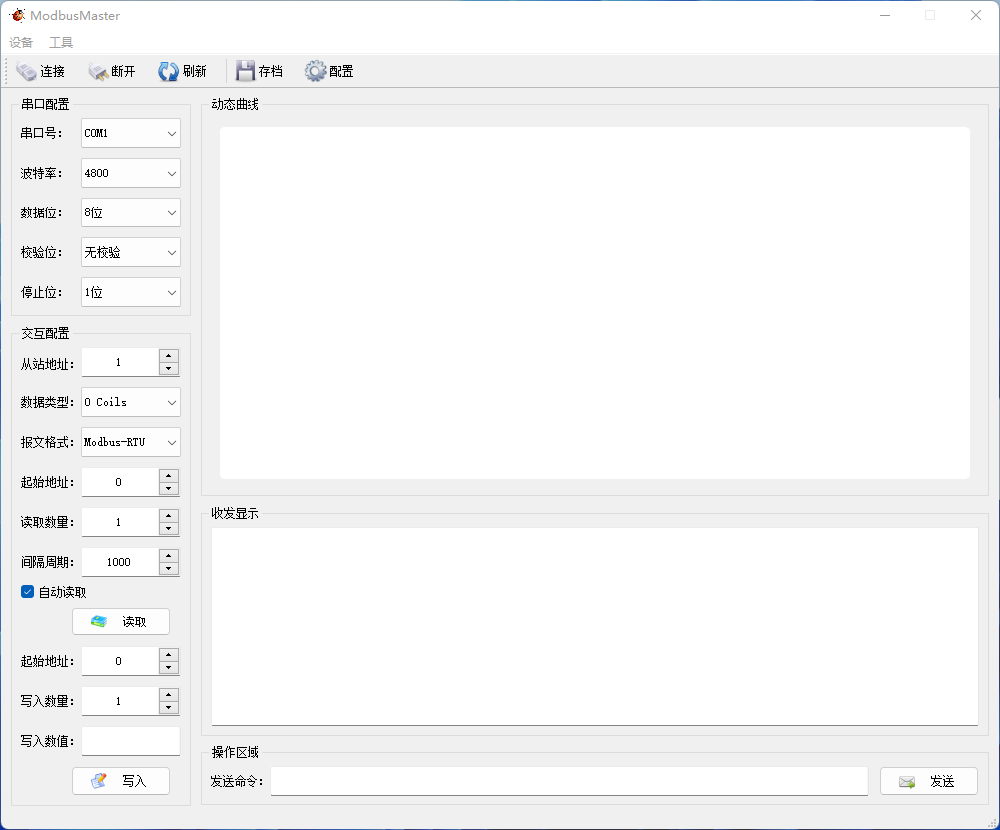
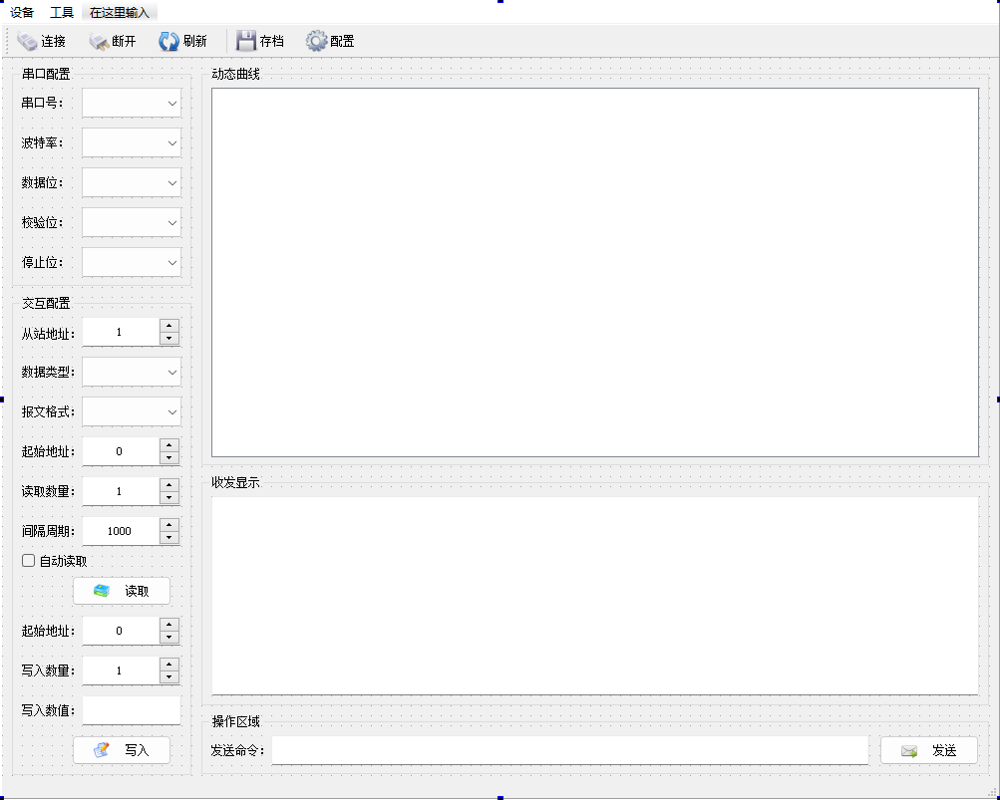

# ModbusMaster
&emsp;&emsp;Modbus是一种常见的工业系统通讯协议。在我们的设计开发工作中经常使用到它。在这一篇中我们将简单实现一个基于QT的Modbus RTU主站上位工具。
## 1、概述
&emsp;&emsp;Modbus RTU主站应用很常见，有一些是通用的，有一些是专用的。而这里我们希望实现一个主要针对我们的产品调试的Modbus RTU主站工具。
在开始软件设计之前，我们先来简略地分析一下，实现这样一个Modbus RTU主站工具包含的主要内容有哪些。我们认为软件需要如下几个方面的内容：
### （1）、串口参数的配置
&emsp;&emsp;Modbus RTU通过串口来实现通讯，所以我们需要对串口相关的参数进行配置。对串口的配置主要是串口名、波特率、校验位、数据位和停止位等。对于这些参数我们让使用着可以根据需要选择。
&emsp;&emsp;而串口号，我们希望软件可以自动搜索当前可用的串口列表。而且我们可以通过操作更新可用的串口列表。对串口的操作主要是串口的打开与关闭。
### （2）、从站信息的配置
&emsp;&emsp;我们实现Modbus RTU主站应用就是访问从站的数据，所以我们需要在主站应用中配置从站的信息。主要有站地址、数据类型、数据格式等，我们将其设置为可以选择。
&emsp;&emsp;读取从站的参数配置，主要是起始地址、读取的数量。写从站参数的配置，主要是起始地址、写入的数量以及写入的数值。
### （3）、对从站的操作
&emsp;&emsp;Modbus RTU主站对从站的操作无非是读从站数据和写从站数据，我们通过制定读写的寄存器类型、起始地址、数量等通过按钮操作来实现读写命令的发送。
&emsp;&emsp;除了手动操作读写外，很多时候我们可能需要Modbus RTU主站自动周期性的读取从站的数据。所以我们让其可以选择以多长的周期自动循环读取。
### （4）、对信息的显示
&emsp;&emsp;接收信息的显示，作为一款工具软件， 我们当然希望看到我们发给从站的命令究竟有没有成功，最简单的和直观的办法就是将接收到的信息显示出来。对于Modbus RTU主站当然是显示对应的地址的值。
&emsp;&emsp;同样的，我们有时候想要看到发送和接收到的原始报文，所以我们对发送和接收到的报文也作相应的显示。
&emsp;&emsp;对于个别数据有时候我们还希望看到他的变化趋势，所以我们可以添加一个图形显示，用以显示我们制定的数据的变化趋势。
&emsp;&emsp;运行状态的显示， 我们希望对操作的状态进行反馈以指示操作的动作是否执行，所以我们需要状态栏来实现这一需求。
## 2、界面设计
&emsp;&emsp;根据上一节中分析的需求，我们先来设计软件的界面。我们在QT中基于QMainWindow类生成一个操作界面，包括菜单栏、工具栏和状态栏以满足需求中对状态显示及操作命令的要求。
&emsp;&emsp;而在中间显示区域，我们将其划分为2列。在左边的一列从上到下设置：串口配置操作区域和读写从站的交互配置区域。在右侧的一列从上到下设置：动态曲线显示区域、收发消息显示区域以及直接输入报文发送命令的输入区域。具体的界面设置如下图所示：
 
&emsp;&emsp;完成如上图的布局后，我们可以选择在属性中配置控件的参数，也可以在代码中添加相关的参数。在这里在代码中通过初始化形式完成参数的设置。完成整个布局后我们先试着运行程序，正常运行则出现如下的界面：
 
&emsp;&emsp;上图就是完成布局后的运行界面，不过我们还没有实现相应的编码，所以目前尚不能实现我们第一节中所预想的功能。

